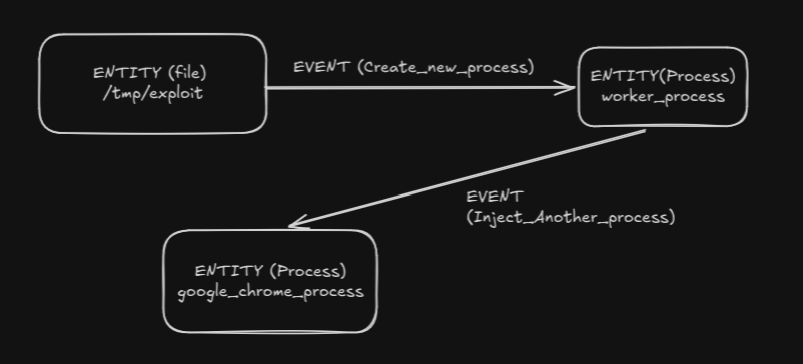

# TA1 Report - Prionyx

There are four things a triage system needs to do: 
1. detect malicious processes/files
2. identify what they are
3. reconstruct how they got there
4. build a timeline

### Sources

1. [NIST SP 800-86 - Guide to Integrating Forensic Techniques into Incident Response](https://nvlpubs.nist.gov/nistpubs/Legacy/SP/nistspecialpublication800-86.pdf)
2. [SLEUTH: Real-time Attack Scenario Reconstruction from COTS Audit Data](https://www.usenix.org/system/files/conference/usenixsecurity17/sec17-hossain.pdf)
3. [Linux Matrix - MITRE ATT&CK](https://attack.mitre.org/matrices/enterprise/linux/)
4. [CAPA Project](https://mandiant.github.io/capa/)


### False Positives that I usually encounter

| Signal                | Potential false positive   | How to distinguish                   |
| --------------------- | -------------------------- | ------------------------------------ |
| SUID                  | `/usr/bin/sudo`            | known system/package-owned binary    |
| SUID                  | Flatpak/container          | trust domain                         |
| deleted executable    | normal package upgrade     | process age + package ownership      |
| process name mismatch | legitimate daemon behavior | ancestry + executable                |
| `/tmp` execution      | installer                  | process ancestry + command line      |
| root process          | normal daemon              | parent/service relationship          |
| network listener      | legitimate service         | executable + port + service identity |
| cron                  | legitimate maintenance job | command ownership + path + user      |

---

# NIST SP 800-86 - Insights

#### What to prioritize when collecting data?
- Develop a plan to acquire data
- Multiple potential data sources
- Analyst should create a plan based on prioritization
- Priority HIGH VALUE DATA > HIGHLY VOLATILE DATA > EASILY ACQUIREABLE DATA

### File Modification, Access, and Creation Times
- MAC(modification, access and creation) time collection is very important 
- If an analyst needs to establish an accurate timeline of events, then the file times should be preserved.
- The computerís clock does not have the correct time. For example, the clock may not have been
synchronized regularly with an authoritative time source.
- The time may not be recorded with the expected level of detail, such omitting the seconds or
minutes.
- An attacker may have altered the recorded file times.

### Other recommendations
- Analysts should examine copies of files, not the original files.
- Analysts should preserve and verify file integrity. 
- Analysts should rely on file headers, not file extensions, to identify file content types.

### What data can be collected from the OS?

#### Non Volatile Data
- Configuration Files - both OS configuration + application configuration
- Users and Groups
- Password Files
- Scheduled Jobs
- System Event logs
- Audit Records
- Application Events
- Command History
- Recently accessed Files
- Swap File
- Dump File - For errors in OS
- Hibernation File
- Temporary Files
- Network Shares

#### Volatile Data
- Memory Slack Space
- Free Space
- Network Configurations
- Network Connections
- Running Processes
- Open Files
- Login Sessions
- Operating System Time - Important for correlating events

-> In priority Order
1. Network connections
2. Login sessions
3. Contents of memory
4. Running processes
5. Open files
6. Network configuration
7. Operating system

---

# SLEUTH Paper - Insights (August 2017)

- Analysts lack the tools to “connect the dots,” i.e. piece together fragments of an attack campaign that span multiple applications
- Challenges presented in the paper
  - Event storage and analysis: How to store millions of records effeciently and let algorithm analyse it 
  - Prioritizing entities for analysis: How to assist the forensic analyst into prioritizing what is the MOST important
  - Scenario reconstruction: How do we reconstruct the whole sceneario and timeline
  - Dealing with common usage scenarios: How to differentiate between legitimate user activity and malicious activity
  - Fast reasoning

## How does SLEUTH work? 
- Audit data from these OS is processed into a platform-neutral graph representation
- where vertices represent subjects (processes) and objects (files, sockets), and edges denote audit events (eg operations such as read, write, execute, and connect)
- This graph serves as the basis for attack detection as well as root cause analysis and scenario reconstruction.
- Compact in-memory graph for extremely fast analysis
- tag based system to priorize suspiscious entities
- Algorithms for backward root cause analysis and forward impact analysis
- Customizable policy framework for reducing false positives

## Custom in-memory graph
- Each vertice represents an entity
- 2 Types of entity in the graph -> Subject and Object
- Subject = Processes
- Object = Files, Pipes, Sockets, Network Connections
- Both of these carry information about the artifact
- Events becone labelled edges between these entities

EXAMPLE:



- read, write, connect, execve, open, close (Events)
- Graph is stored in Main Memory
- Traversal is very fast
- Uses 32 bit identifiers instead of 64 bit pointers
```
    struct Event {
    struct Subject *subject;
    struct Object *object;
    struct Event *next;
    }; 

    // Instead of this we an use identifiers
    subject_id = 431
    object_id  = 923

    // Refer to them directly
    subjects[431]
    objects[923]

    struct Event{
    uint32_t file_id;
    uint32_t process_id;
    uint32_t event_id;
    }
```
- Reduces memory usage

### Other important optimization
- Events > Entities (No of events are more than no of Entities)
- Hence instead we represent events using tags
- Common events - Read, Write, Execute can be stored in very less space
- SLEUTH also uses relative timestamp for saving space
- Other optimizations can be directly referred from the paper once I start implementing.

## Tags and Attack Detection
- Tags are very important insight for context
- Tags can be made on the basis of:
  - Where the entity came from -> Package from linux repository/ package from an npm repository
  - Trusted unverified / verified sources
  - Unknown sources
  - Sensitive/Secret entities
  - Private/Public entities

- Tag is propagated through the dependency graph
```
File downloaded From the internet ----> Process Executed ----> Edits Config file
      #UNTRUSTED                        #UNTRUSTED              #UNTRUSTED
```

- These tags can be used to detect an attack
- Untrusted code execution
```
Unknown file ----> Process Executed
 #UNTRUSTED          #UNTRUSTED        
```
- Modification of trusted Objects by untrusted code
```
Unknown file ----> Process Executed ----> WRITE to /etc/passwd
 #UNTRUSTED          #UNTRUSTED             #UNTRUSTED
```
- Confidential data leak
```
Unknown Process ----> Reads Secret File/Credential ----> Sends Network Request
 #UNTRUSTED              #UNTRUSTED                        #UNTRUSTED
```
- Untrusted File Executed
```
Unknown file ---chmod +x--> Unknown file given execute permissions
 #UNTRUSTED                              #UNTRUSTED            
```
- `#Untrusted` tag is inherited no matter how many layers the untrusted data travels through
- Through these tags we can determine what happened between entities + trust context of those entities

## Policy Engine

- 


---

# How can I make PRIONYX?

Prionyx as it is currently can be built as a combination of three different layers:

1. Artifact analyzer: Checks current state and does Incident response, Prints out suspicious processes/files currently running in the system. 
   
2. Historical Log analyzer: Parses logs from the past, checks for activity,constructs graph, co-relates current state to the past, constructs attack chain.
   
3. Reporting Mechanism: Parses all information and prints out a report.

```
                    PRIONYX
                       |
             +---------+---------+
             |                   |
       CURRENT SNAPSHOT       HISTORICAL
             |                   |
       /proc, files,        audit/system logs
       sockets, users,           |
       permissions               v
             |             parse events
             |                   |
             v                   v
       Artifact analysis    Dependency graph
             |                   |
             +---------+---------+
                       |
                       v
                 CORRELATION
                       |
          "Does the current suspicious
           artifact have a history?"
                       |
                       v
              Timeline / Findings
                       |
                       v
                    REPORT
```

### 1. Current-state analysis

PRIONYX asks:

> "What looks suspicious on this machine right now?"

Examples:

* suspicious process
* deleted executable
* `/tmp` executable
* unusual SUID binary
* suspicious network connection
* process with strange parent
* modified sensitive file

### 2. Historical analysis

Then:

> "How did this get here?"

Read audit/system logs and reconstruct:

```
download
   ↓
file created
   ↓
file modified
   ↓
permission changed
   ↓
process executed
   ↓
/etc/passwd modified
```

### 3. Correlation

Connect the snapshot artifact to its historical activity.

For example:

```
CURRENT:
PID 431 → /tmp/.x → suspicious

             ↑
             |
HISTORY:
curl → created /tmp/.x
     → chmod +x
     → executed
```

Now you have much stronger evidence than simply saying:

> "`/tmp/.x` is executable, therefore suspicious."

### 4. Report

Finally produce something like:

```
Incident: Suspicious executable

Current findings:
  PID: 431
  Executable: /tmp/.x
  Parent: bash
  Network: 10.0.0.5:4444

Historical reconstruction:
  02:31:12  File created
  02:31:15  Permission changed
  02:31:17  Process executed
  02:31:19  Network connection established

Assessment:
  Suspicious execution chain detected
```

The important architectural idea is that **snapshot analysis and historical graph analysis are two different layers**, connected by common identifiers such as PID, inode/device, path, timestamps, hashes, sockets, etc.
